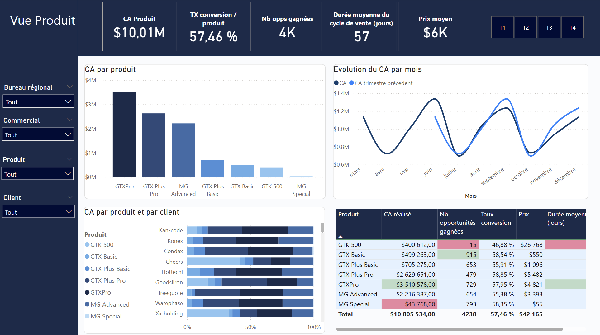
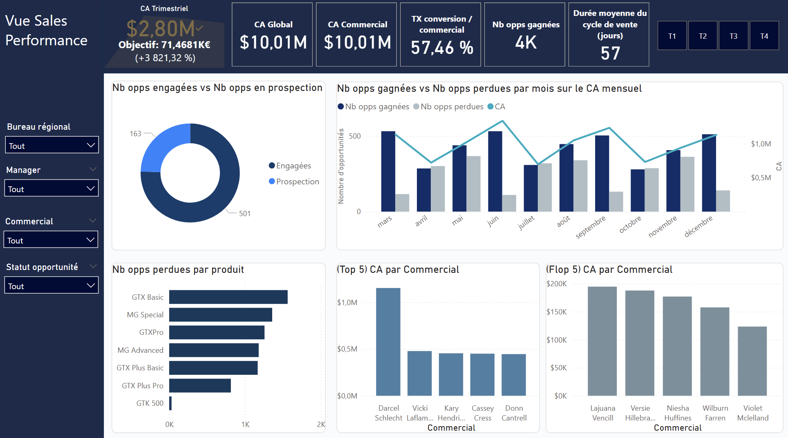
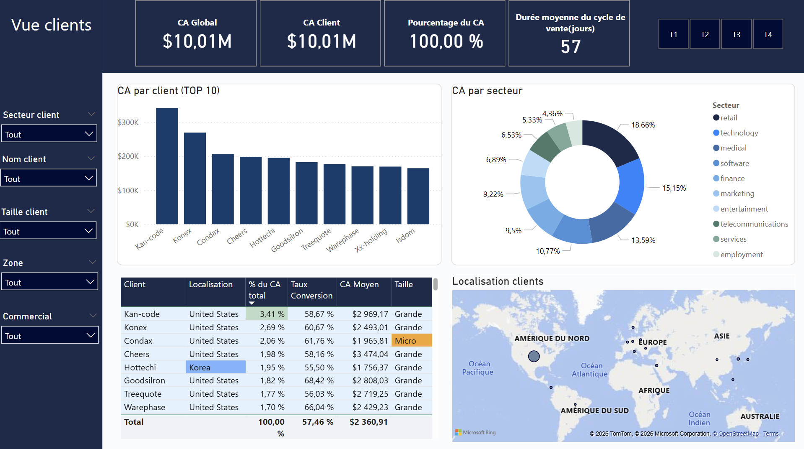

# Sales CRM Analytics — Analyse des performances commerciales

## Objectif
Analyser les données CRM pour comprendre les facteurs qui influencent la performance commerciale.

## Dataset
Le projet utilise plusieurs tables :
- sales_pipeline
- accounts
- products
- sales_teams

## Préparation des données
- gestion des valeurs manquantes
- harmonisation des noms produits
- création d’indicateurs (conversion rate, temps de vente, CA par client)

## Insights clés
- forte corrélation entre nombre de deals gagnés et chiffre d’affaires
- GTX Pro est le produit le plus stratégique
- la performance commerciale dépend beaucoup du volume d’opportunités
- les bureaux régionaux ont des performances similaires

## Dashboard Power BI
Dashboard interactif permettant d'analyser :
- performance commerciale
- performance produit
- performance des équipes
- évolution des ventes
- 
## Télécharger le dashboard
[Télécharger le fichier Power BI (.pbix)](Projet_Elevyte.pbix)

### Aperçu

## Outils
Python (Pandas, Matplotlib, Seaborn)  
Power BI  
GitHub

## Notebook Python

L'analyse complète est disponible ici :

👉 [Voir le notebook](notebooks/sales_crm_analysis.ipynb)
