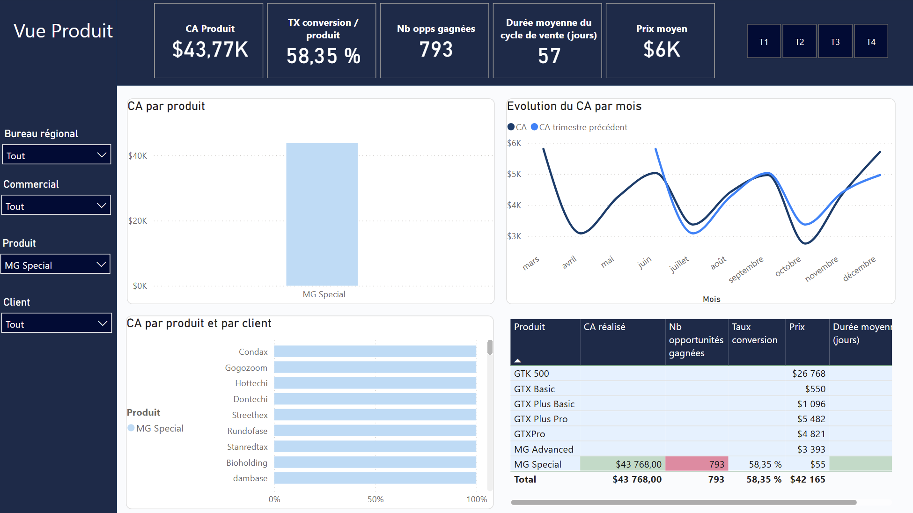
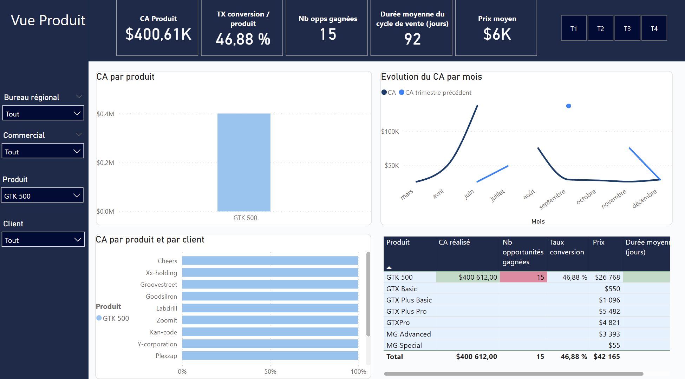

# Sales CRM Analytics — Analyse des performances commerciales

> **Note :** Elevyte Analytics est une entreprise fictive créée dans le cadre d'un projet de data storytelling. Les données utilisées sont issues d'un dataset Kaggle enrichi d'un scénario métier simulé.

## Ressources

👉 [Voir le notebook Python](https://github.com/LaetitiaMilon/Sales-CRM-Analytics/blob/main/notebooks/sales_crm_analysis.ipynb)

📥 [Télécharger le dashboard Power BI (.pbix)](Projet_Elevyte.pbix)

---

## Elevyte Analytics

Cabinet de conseil en Data & Business Intelligence, spécialisé dans l'exploitation et la valorisation des données pour la prise de décision.

**Notre mission :** Accompagner un acteur majeur des télécommunications basé aux États-Unis dans l'analyse de ses données CRM et l'optimisation de ses revenus grâce à des insights actionnables.

---

## Notre client

- Acteur majeur des télécommunications américain, présent depuis 2006
- **10 M$** de chiffre d'affaires annuel
- **35 commerciaux** répartis sur les régions Est, Ouest et Centre
- Offre technologique diversifiée couvrant plusieurs gammes et besoins clients

---

## Contexte de l'analyse

| | |
|---|---|
| **Période étudiée** | Du 20 octobre 2016 au 27 décembre 2017 |
| **Source des données** | 4 tables : sales_pipeline, accounts, products, sales_teams — 8 800 observations |
| **Feature Engineering** | Enrichissement des données, modélisation des objectifs commerciaux |

---

## Problématique

> **Comment analyser les données issues du CRM pour maximiser les revenus et améliorer la performance globale des ventes ?**

---

## 3 Axes d'analyse

| Axe | Question |
|---|---|
| **Client** | Qui sont les clients à plus fort potentiel ? |
| **Produit** | Quels produits contribuent à la hausse ou à la baisse du CA et quelle stratégie adopter ? |
| **Performance commerciale** | Comment optimiser le mix produit et la performance des bureaux pour accroître la rentabilité ? |

---

## I. Analyse Client

80 % de la clientèle est basée aux États-Unis, le reste réparti entre l'Europe, l'Asie et l'Amérique latine.

### Secteurs clés à fort potentiel de croissance

- **Retail & Technologie** : principaux moteurs de CA (18,66 % + 15,15 %)
- **Software & Finance** : soutien à la performance (13,59 % + 10,77 %)
- Diversification équilibrée — forte valeur ajoutée et potentiel de croissance

### Analyse stratégique du portefeuille client

- **Kan-code** : opportunité d'optimiser le CA moyen
- **Condax** : illustration du potentiel de croissance sur le segment des micro-entreprises
- **Hottechi** : expansion internationale réussie

---

## II. Analyse Produit

### Chiffre d'affaires par produit

Trois produits dominent clairement le marché : **GTX Pro, GTX Plus Pro et MG Advanced** — parts de marché cumulées : **83 %**

- La part de marché du seul produit de la gamme GTK est de **4 %**
- **MG Special** est largement en retrait avec un CA à **0,44 %** du total

### Volumes de vente

- **MG Special** représente 1 vente sur 5 — absorbe une part significative de l'effort commercial pour seulement 0,44 % du CA (coût unitaire : 55$)
- **GTK 500** : seulement 0,35 % des opportunités gagnées mais contribue à **4 % du CA** (coût unitaire : 26K$)

### Focus MG Special

MG Special génère un volume important de deals (793 opportunités) pour une valeur très faible ($43 768) — levier d'optimisation prioritaire. Le rapport effort commercial / CA généré est clairement déséquilibré.

### Focus GTK 500

Tous les clients ayant acheté le GTK 500 sont de **grandes entreprises américaines** (250+ employés). 27 % appartiennent au secteur entertainment, suivis par la finance et le retail.

L'évolution mensuelle du CA montre des points isolés — le GTK 500 ne génère des ventes que sur quelques mois dans l'année, confirmant son caractère rare et premium. Avec seulement **15 deals conclus**, il contribue malgré tout à **4 % du CA global** grâce à un prix unitaire moyen de **$26 768**.

### Analyse par client

Les clients achètent souvent plusieurs produits et complètent leur gamme au fil du temps — **base client fidèle et contrats long terme**.

---

## III. Analyse du cycle de vente

**Hypothèse :** Les deals gagnés prennent-ils moins de temps à se conclure ?

**Résultat :** La durée moyenne du cycle de vente est équivalente pour les opportunités perdues et gagnées.

**Interprétation :** Le temps passé n'explique pas la perte des deals — d'autres facteurs interviennent.

**Conclusion :** Les données disponibles ne précisent pas les causes de perte (juridiction, coupe budgétaire, concurrence, suivi insuffisant...)

---

## IV. Performance commerciale

Sur 10 M$ de CA, certains bureaux privilégient le **volume**, d'autres la **valeur** — c'est là que se cache l'opportunité de croissance.

### GTX Basic vs GTX Pro / Plus Pro

| | GTX Basic | GTX Pro / Plus Pro |
|---|---|---|
| Positionnement | Produit le plus vendu | Produit le plus rentable |
| Deals gagnés | 915 (21,59 %) | 729 / 479 (17,2 % / 15,43 %) |
| CA généré | 499K$ | 3,5M$ / 2,6M$ |
| Cycle de vente | 59 jours | 54 / 55 jours |

**Enjeu clé : trouver l'équilibre entre volume de ventes et valeur générée.**

### Performance régionale

| Bureau | CA | Conversion | Opportunités | Cycle |
|---|---|---|---|---|
| **Ouest** — combinaison gagnante | 3,57M$ | 58,01 % | 1 000 | 69 jours |
| **Centre** — fort volume, faible valeur | 3,35M$ | 56,15 % | 2 000 | 51 jours |
| **Est** — efficace mais sous-exploité | 3,09M$ | 58,70 % | 1 000 | 59 jours |

---

## V. Insights stratégiques

1. Les écarts de performance ne viennent pas du rythme de vente mais de la **qualité du portefeuille produit** et de la capacité à convertir des deals à forte valeur
2. En renforçant la présence sur les secteurs moins porteurs, chaque bureau pourrait **diversifier ses sources de revenus** et rééquilibrer la performance globale
3. La formation sur la stratégie de **mix produit** pourrait réduire l'écart entre la performance des commerciaux

---

## VI. Recommandations

- **Implantation internationale** : nouer des partenariats stratégiques avec les acteurs du terrain
- **Clients** : segmenter afin de mieux connaître leurs attentes — commandes volumineuses ou à forte valeur ajoutée
- **Produits** : adapter la stratégie de vente en fonction des spécificités de chacun (entrée de gamme vs premium)
- **Secteurs** : focaliser les efforts commerciaux sur les secteurs encore sous-exploités

---

## Outils utilisés

`Python` `pandas` `Power BI` `DAX` `SQL` `GitHub`

## Méthodologie

1. **Préparation & nettoyage des données** (Python / pandas) : valeurs manquantes, normalisation, fusion des tables, création de colonnes dérivées
2. **Modélisation** (Power BI) : modèle en étoile, relations 1-N, types normalisés
3. **Mesures DAX** : KPIs commerciaux, analyse du cycle de vente, segmentation
4. **Visualisation** : dashboards thématiques avec navigation par filtres et segments
